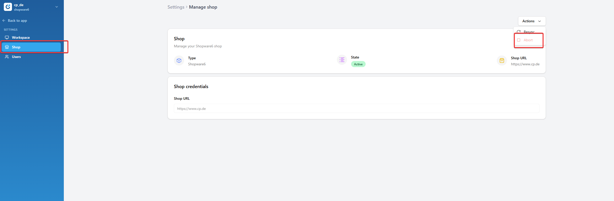

# How to Abort a Sync in Shopware 6

This guide shows you how to abort a synchronization process when your Shopware 6 shop is stuck in the **Indexing** state.

## Problem

Your Shopware 6 shop shows an **Indexing** state in the cobby Portal and the sync process appears to be stuck. This can happen when:

- The Shopware indexer is taking longer than expected
- A network interruption occurred during sync
- The shop server became unresponsive during the process

## Prerequisites

- Access to the cobby Portal ([app.cobby.io](https://app.cobby.io))
- A Shopware 6 shop connected to cobby
- The shop state shows **Indexing** or appears stuck

## Steps

### 1. Open the cobby Portal

1. Go to [app.cobby.io](https://app.cobby.io).
2. Log in with your credentials.
3. Select your workspace.

### 2. Navigate to Shop Settings

1. Click **Settings** in the left sidebar.
2. Click **Shop** to open the shop management page.

### 3. Abort the Sync

1. Click the **Actions** dropdown in the top-right corner of the shop card.
2. Select **Abort** from the dropdown menu.

3. Confirm the action if prompted.
4. Wait for the process to complete. The shop state will change from **Indexing** to **Active**.

:::warning
Aborting a sync will stop the current indexing process. Any incomplete data synchronization will need to be re-triggered manually.
:::

### 4. Resume Normal Operations

After aborting, you can:

1. **Resume the sync** — Click **Actions** → **Resume** to restart the synchronization.
2. **Run a Resync** — If data seems inconsistent, perform a full resynchronization.
3. **Continue working** — If the shop state shows **Active**, you can continue using cobby normally.

## When to Use This Feature

| Situation | Action |
|-----------|--------|
| Sync stuck for more than 10 minutes | Abort and retry |
| Need to make urgent changes | Abort, make changes, then resync |
| Server maintenance required | Abort to safely disconnect |
| Error messages appearing | Abort and check shop connectivity |

## Troubleshooting

### Abort button is not available

- The shop may not be in an indexing state. Check the current state indicator.
- Refresh the page and try again.
- Contact [cobby support](https://cobby.io/contact) if the issue persists.

### Shop still shows Indexing after abort

- Wait a few seconds and refresh the page.
- Check your network connection.
- Try logging out and back into the portal.

### Data inconsistencies after abort

- Run a full resynchronization to ensure all data is properly synced.
- Check the job history for any error messages.

## Related

- [How to Fix Connection Issues](/how-to/troubleshooting/fix-connection-issues) — Troubleshoot shop connectivity
- [Install cobby for Shopware 6](/how-to/installation/install-cobby-shopware-6) — Initial setup guide
